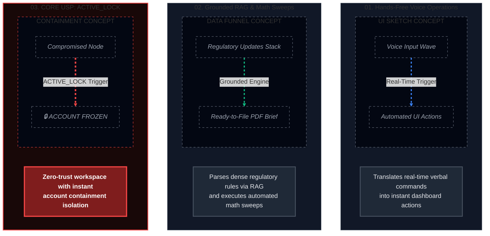

```mermaid
graph TD
    %% Main Columns / Features
    subgraph FEAT1 [01. Hands-Free Voice Operations]
        F1_DESC[Translates real-time verbal commands<br>into instant dashboard actions]
        subgraph SKETCH1 [UI SKETCH CONCEPT]
            S1[Voice Input Wave] -->|Real-Time Trigger| S2[Automated UI Actions]
        end
    end

    subgraph FEAT2 [02. Grounded RAG & Math Sweeps]
        F2_DESC[Parses dense regulatory rules via RAG<br>and executes automated math sweeps]
        subgraph SKETCH2 [DATA FUNNEL CONCEPT]
            S3[Regulatory Updates Stack] -->|Grounded Engine| S4[Ready-to-File PDF Brief]
        end
    end

    subgraph FEAT3 [03. CORE USP: ACTIVE_LOCK]
        F3_DESC[Zero-trust workspace with instant<br>account containment isolation]
        subgraph SKETCH3 [CONTAINMENT CONCEPT]
            S5[Compromised Node] -->|ACTIVE_LOCK Trigger| S6[🔒 ACCOUNT FROZEN]
        end
    end

    %% Class Assigning
    class F1_DESC,F2_DESC feature;
    class F3_DESC usp;
    class S1,S2,S3,S4,S5,S6 sketch;

    %% Global Slide Styles
    classDef default fill:#111827,stroke:#374151,stroke-width:2px,color:#F3F4F6;
    classDef feature fill:#1F2937,stroke:#4B5563,stroke-width:2px,color:#E5E7EB;
    classDef usp fill:#7F1D1D,stroke:#EF4444,stroke-width:3px,color:#FFFFFF,font-weight:bold;
    classDef sketch fill:#030712,stroke:#6B7280,stroke-width:1px,stroke-dasharray: 5 5,color:#9CA3AF,font-style:italic;

    %% Layout adjustments
    style FEAT1 fill:#111827,stroke:#374151
    style FEAT2 fill:#111827,stroke:#374151
    style FEAT3 fill:#180808,stroke:#EF4444,stroke-width:2px
    style SKETCH1 fill:#030712,stroke:#6B7280,stroke-dasharray: 5 5
    style SKETCH2 fill:#030712,stroke:#6B7280,stroke-dasharray: 5 5
    style SKETCH3 fill:#030712,stroke:#EF4444,stroke-dasharray: 5 5

    %% ⚡ Running Flow Animation Definitions
    linkStyle 0 stroke:#3B82F6,stroke-width:3px,stroke-dasharray: 5,animation: actionFlow 2s linear infinite;
    linkStyle 1 stroke:#10B981,stroke-width:3px,stroke-dasharray: 5,animation: actionFlow 2s linear infinite;
    linkStyle 2 stroke:#EF4444,stroke-width:4px,stroke-dasharray: 5,animation: actionFlow 0.5s linear infinite;

    %% Custom CSS Injection for live viewers (Not supported on native GitHub markdown)
    %% Note: This block creates the moving marching-ants dash effect on the lines
    %% @meta {"style": {"css": "@keyframes actionFlow { from { stroke-dashoffset: 20; } to { stroke-dashoffset: 0; } }"}}
```
