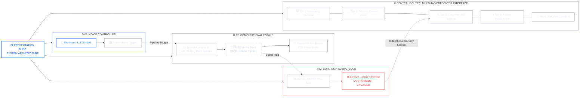

```mermaid
graph LR
    %% Widescreen Layout Initialization (Forces parallel landscape generation)
    
    %% Slide Left Boundary Anchor
    SLIDE_START[📺 PRESENTATION SLIDE:<br>SYSTEM ARCHITECTURE]:::slideFrame

    %% ==================== TOP NAVIGATION ROW ====================
    subgraph NAV [🌐 CENTRAL ROUTER: MULTI-TAB PRESENTER INTERFACE]
        T1[📊 Tab 1: Monitoring Terminal]:::widget
        T2[🧠 Tab 2: Gemma Reason Desk]:::widget
        T3[🔍 Tab 3: Customer 360 Lookup]:::widget
        T4[⚡ Tab 4: Actions Remediation]:::widget
        T5[🔐 Tab 5: IAM View Directory]:::widget
        T1 --- T2 --- T3 --- T4 --- T5
    end

    %% ==================== PARALLEL FUNCTIONAL COLUMNS ====================
    subgraph COL1 [🎙️ 01. VOICE CONTROLLER]
        V_Mic[🎤 Mic Input: LISTENING]:::voiceActive --> V_Macro[🎛️ Action Macro Trigger]:::widget
    end

    subgraph COL2 [⚙️ 02. COMPUTATIONAL ENGINE]
        M_Sweeps[📈 gemma4_engine.py<br>48hr Rolling Math Sweeps]:::widget --> M_FAISS[🧬 FAISS Vector Store<br>RBI Directions Context]:::dataNode
        M_FAISS --> M_PDF[📄 ReportLab Automated<br>PDF Filing Briefs]:::widget
    end

    subgraph COL3 [🚨 03. CORE USP: ACTIVE_LOCK]
        A_Signal[⚠️ Section 4.2 PEP Risk Alert]:::widget --> A_Lock[🔒 ACTIVE_LOCK SYSTEM<br>CONTAINMENT ENGAGED]:::alertActive
    end

    %% ==================== WIDESCREEN ALIGNMENT ROUTING ====================
    SLIDE_START --> NAV
    SLIDE_START --> COL1
    SLIDE_START --> COL2
    SLIDE_START --> COL3

    %% Inter-widget structural data dependencies
    V_Macro -.->|Pipeline Trigger| M_Sweeps
    M_FAISS -.->|Signal Flag| A_Signal
    A_Lock -.->|Bidirectional Security Lockout| T3

    %% Global Color Blueprint Parameters (Enforcing complete transparency to kill black boxes)
    classDef default fill:none,stroke:#475569,stroke-width:2px,color:#F8FAFC;
    classDef slideFrame fill:none,stroke:#3B82F6,stroke-width:3px,color:#3B82F6,font-weight:bold;
    classDef widget fill:none,stroke:#64748B,stroke-width:1px,color:#E2E8F0;
    classDef voiceActive fill:none,stroke:#3B82F6,stroke-width:2px,color:#60A5FA,font-weight:bold;
    classDef alertActive fill:none,stroke:#EF4444,stroke-width:2px,color:#F87171,font-weight:bold;
    classDef dataNode fill:none,stroke:#94A3B8,stroke-width:1px,stroke-dasharray: 3 3,color:#CBD5E1;

    %% Clear block fills to match dark/light theme shifts natively
    style NAV fill:none,stroke:#475569
    style COL1 fill:none,stroke:#3B82F6,stroke-width:1px
    style COL2 fill:none,stroke:#475569,stroke-width:1px
    style COL3 fill:none,stroke:#EF4444,stroke-width:1px
```
