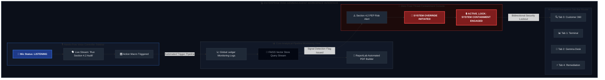

```mermaid
graph TD
    %% Main Application Frame Mockup
    subgraph APP [💻 ENTERPRISE RISK-GEMMA4-AGENT WORKSPACE INTERFACE]
        
        %% Central Header / Navigation Tabs Mock
        subgraph NAV [🌐 Central Navigation Tab Bar Router]
            T1[📊 Tab 1: Terminal]
            T2[🧠 Tab 2: Gemma Desk]
            T3[🔍 Tab 3: Customer 360]
            T4[⚡ Tab 4: Remediation]
        end

        %% Left Column: Voice Control Workspace Component
        subgraph COL1 [🎙️ Hands-Free Voice Controller Sidebar]
            V1[🎤 Mic Status: LISTENING]
            V2["🗣️ Live Stream: 'Run Section 4.2 Audit'"]
            V3[🎛️ Action Macro Triggered]
            V1 --> V2 --> V3
        end

        %% Center Column: Core Analytics View Component
        subgraph COL2 [📊 Core Analytical Pipeline Monitoring View]
            M1[📈 Global Ledger Monitoring Logs]
            M2[🧬 FAISS Vector Store Query Stream]
            M3[📄 ReportLab Automated PDF Builder]
            M1 --> M2 --> M3
        end

        %% Right Column: Security Isolation Threat Console Component
        subgraph COL3 [🚨 Zero-Trust Threat Containment Console]
            A1[⚠️ Section 4.2 PEP Risk Alert]
            A2[🔴 SYSTEM OVERRIDE INITIATED]
            A3[🔒 ACTIVE_LOCK: SYSTEM CONTAINMENT ENGAGED]
            A1 --> A2 --> A3
        end

    end

    %% Class Assigning (Moved from inline to footer block to satisfy GitHub strict compilation)
    class T1,T2,T3,T4,V2,V3,M1,M3,A1 widget;
    class V1 voiceActive;
    class A2,A3 alertActive;
    class M2 dataNode;

    %% Global Workspace Styles (GitHub and Live Editor Safe)
    classDef default fill:#111827,stroke:#374151,stroke-width:2px,color:#F3F4F6;
    classDef widget fill:#1F2937,stroke:#374151,stroke-width:1px,color:#E5E7EB;
    classDef voiceActive fill:#1E3A8A,stroke:#3B82F6,stroke-width:2px,color:#FFFFFF,font-weight:bold;
    classDef alertActive fill:#7F1D1D,stroke:#EF4444,stroke-width:3px,color:#FFFFFF,font-weight:bold;
    classDef dataNode fill:#030712,stroke:#4B5563,stroke-width:1px,stroke-dasharray: 3 3,color:#9CA3AF;

    %% Apply structural layout formatting to top boxes
    style APP fill:#0B0F19,stroke:#1E293B,stroke-width:2px
    style NAV fill:#111827,stroke:#374151
    style COL1 fill:#111827,stroke:#3B82F6,stroke-width:1px
    style COL2 fill:#111827,stroke:#4B5563,stroke-width:1px
    style COL3 fill:#1C0A0A,stroke:#EF4444,stroke-width:1px

    %% Inter-widget interface dependencies data routing pathways
    V3 -->|Automated Trigger Pipeline| M1
    M2 -->|Signal Detection Flag Issued| A1
    A3 -->|Bidirectional Security Lockout| T3
```
