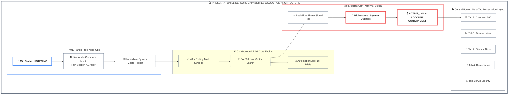

```mermaid
graph TD
    %% Main Slide Wrapper Frame
    subgraph SLIDE [📺 PRESENTATION SLIDE: CORE CAPABILITIES & SOLUTION ARCHITECTURE]
        
        %% Central Top Navigation Tabs Framework
        subgraph NAV [🌐 Central Router: Multi-Tab Presentation Layout]
            T1[📊 Tab 1: Terminal View]
            T2[🧠 Tab 2: Gemma Desk]
            T3[🔍 Tab 3: Customer 360]
            T4[⚡ Tab 4: Remediation]
            T5[🔐 Tab 5: IAM Security]
        end

        %% Left Column: Voice Feature Node
        subgraph COL1 [🎙️ 01. Hands-Free Voice-Ops]
            V1[🎤 Mic Status: LISTENING]
            V2["🗣️ Live Audio Command Input:<br>'Run Section 4.2 Audit'"]
            V3[🎛️ Immediate System Macro Trigger]
            V1 --> V2 --> V3
        end

        %% Center Column: Core Analytics Processing Node
        subgraph COL2 [⚙️ 02. Grounded RAG Core Engine]
            M1[📈 48hr Rolling Math Sweeps]
            M2[🧬 FAISS Local Vector Search]
            M3[📄 Auto ReportLab PDF Briefs]
            M1 --> M2 --> M3
        end

        %% Right Column: Core USP Feature Node
        subgraph COL3 [🚨 03. CORE USP: ACTIVE_LOCK]
            A1[⚠️ Real-Time Threat Signal Flag]
            A2[🔴 Bidirectional System Override]
            A3[🔒 ACTIVE_LOCK: ACCOUNT CONTAINMENT]
            A1 --> A2 --> A3
        end

    end

    %% Class Matrix Mappings (GitHub strict compiler validation routing)
    class T1,T2,T3,T4,T5,V2,V3,M1,M3,A1 widget;
    class V1 voiceActive;
    class A2,A3 alertActive;
    class M2 dataNode;

    %% Global Workspace Styles (Forced stroke blueprints to eradicate black blocks)
    classDef default fill:none,stroke:#475569,stroke-width:2px;
    classDef widget fill:none,stroke:#64748B,stroke-width:1px;
    classDef voiceActive fill:none,stroke:#3B82F6,stroke-width:2px,font-weight:bold;
    classDef alertActive fill:none,stroke:#EF4444,stroke-width:2px,font-weight:bold;
    classDef dataNode fill:none,stroke:#94A3B8,stroke-width:1px,stroke-dasharray: 3 3;

    %% Outer Boundary Color Normalization Parameters
    style SLIDE fill:none,stroke:#475569,stroke-width:2px
    style NAV fill:none,stroke:#475569
    style COL1 fill:none,stroke:#3B82F6,stroke-width:1px
    style COL2 fill:#none,stroke:#475569,stroke-width:1px
    style COL3 fill:none,stroke:#EF4444,stroke-width:1px

    %% Inter-widget interface dependencies data routing pathways
    V3 --> M1
    M2 --> A1
    A3 --> T3
```
