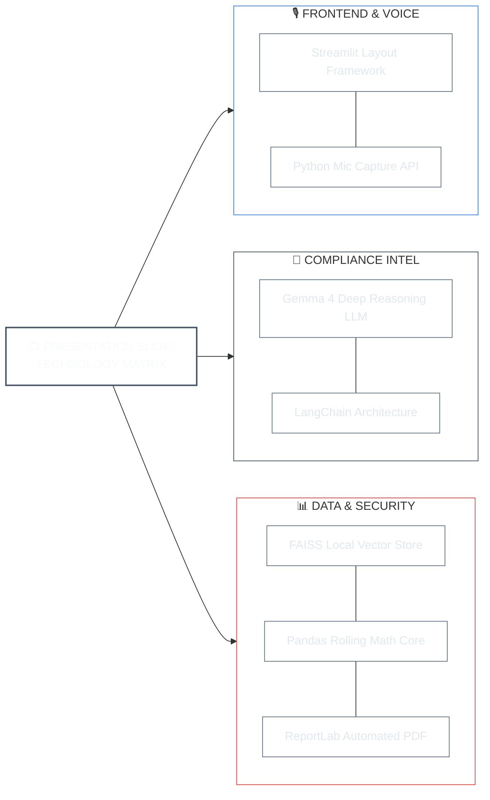

```mermaid
graph LR
    %% Slide Left Boundary Anchor
    TECH_START[📺 PRESENTATION SLIDE:<br>TECHNOLOGY MATRIX]

    %% Parallel Technology Modules
    subgraph MOD1 [🎙️ FRONTEND & VOICE]
        T_Streamlit[Streamlit Layout Framework]
        T_Audio[Python Mic Capture API]
        T_Streamlit --- T_Audio
    end

    subgraph MOD2 [🧠 COMPLIANCE INTEL]
        T_Gemma[Gemma 4 Deep Reasoning LLM]
        T_LangChain[LangChain Architecture]
        T_Gemma --- T_LangChain
    end

    subgraph MOD3 [📊 DATA & SECURITY]
        T_FAISS[FAISS Local Vector Store]
        T_Pandas[Pandas Rolling Math Core]
        T_PDF[ReportLab Automated PDF]
        T_FAISS --- T_Pandas --- T_PDF
    end

    %% Widescreen Alignment Routing
    TECH_START --> MOD1
    TECH_START --> MOD2
    TECH_START --> MOD3

    %% Global Color Blueprint Parameters (Forced transparency to kill black boxes)
    classDef default fill:none,stroke:#475569,stroke-width:2px,color:#F8FAFC;
    classDef widget fill:none,stroke:#64748B,stroke-width:1px,color:#E2E8F0;
    
    class T_Streamlit,T_Audio,T_Gemma,T_LangChain,T_FAISS,T_Pandas,T_PDF widget;
    style MOD1 fill:none,stroke:#3B82F6,stroke-width:1px
    style MOD2 fill:none,stroke:#475569,stroke-width:1px
    style MOD3 fill:none,stroke:#EF4444,stroke-width:1px
```
