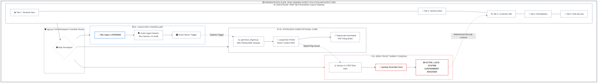

```mermaid
graph TB
    %% Main Presentation Slide Boundary Frame
    subgraph SLIDE [📺 PRESENTATION SLIDE: RISK-GEMMA4-AGENT SOLUTION ARCHITECTURE]
        
        %% Central Top Navigation Tabs Framework (Horizontal Interface Bar)
        subgraph NAV [🌐 Central Router: Multi-Tab Presentation Layout Gateway]
            T1[📊 Tab 1: Terminal View] --- T2[🧠 Tab 2: Gemma Desk] --- T3[🔍 Tab 3: Customer 360] --- T4[⚡ Tab 4: Remediation] --- T5[🔐 Tab 5: IAM Security]
        end

        %% Mid-Tier Architecture Integration Core
        subgraph CORE [🛡️ app.py Core Workspace Controller Router]
            DIRECTION{🛡️ Role Permitted?}
        end

        %% Ground-Level Parallel System Processing Nodes (Widescreen 3-Column Split)
        subgraph COL1 [🎙️ 01. VOICE-OPS CONTROLLER]
            V_Mic[🎤 Mic Input: LISTENING] --> V_Stream["🗣️ Audio Ingest Stream:<br>'Run Section 4.2 Audit'"]
            V_Stream --> V_Macro[🎛️ Action Macro Trigger]
        end

        subgraph COL2 [⚙️ 02. STATELESS COMPUTATIONAL CORE]
            M_Sweeps[📈 gemma4_engine.py<br>48hr Rolling Math Sweeps] --> M_FAISS[🧬 LangChain FAISS<br>Vector Context RAG]
            M_FAISS --> M_PDF[📄 ReportLab Automated<br>PDF Filing Briefs]
        end

        subgraph COL3 [🚨 03. ZERO-TRUST THREAT CONSOLE]
            A_Signal[⚠️ Section 4.2 PEP Risk Alert] --> A_Override[🔴 System Override Form]
            A_Override --> A_Lock[🔒 ACTIVE_LOCK: SYSTEM<br>CONTAINMENT ENGAGED]
        end

    end

    %% Data Orchestration Layout Routing Pathways
    NAV --> DIRECTION
    DIRECTION --> COL1
    DIRECTION --> COL2
    DIRECTION --> COL3

    %% Inter-widget interface dependencies data routing pathways
    V_Macro -.->|Pipeline Trigger| M_Sweeps
    M_FAISS -.->|Signal Flag Issued| A_Signal
    A_Lock -.->|Bidirectional Security Lockout| T3

    %% Class Matrix Mappings (GitHub strict compiler validation routing)
    class T1,T2,T3,T4,T5,V_Stream,V_Macro,M_Sweeps,M_FAISS,M_PDF,A_Signal,A_Override widget;
    class V_Mic voiceActive;
    class A_Lock,A_Override alertActive;
    class DIRECTION dataNode;

    %% Global Workspace Styles (Forced stroke blueprints to completely eradicate black blocks)
    classDef default fill:none,stroke:#475569,stroke-width:2px;
    classDef widget fill:none,stroke:#64748B,stroke-width:1px;
    classDef voiceActive fill:none,stroke:#3B82F6,stroke-width:2px,font-weight:bold;
    classDef alertActive fill:none,stroke:#EF4444,stroke-width:2px,font-weight:bold;
    classDef dataNode fill:none,stroke:#94A3B8,stroke-width:1px;

    %% Outer Boundary Color Normalization Parameters
    style SLIDE fill:none,stroke:#475569,stroke-width:2px
    style NAV fill:none,stroke:#475569
    style CORE fill:none,stroke:#64748B
    style COL1 fill:none,stroke:#3B82F6,stroke-width:1px
    style COL2 fill:none,stroke:#475569,stroke-width:1px
    style COL3 fill:none,stroke:#EF4444,stroke-width:1px
```
