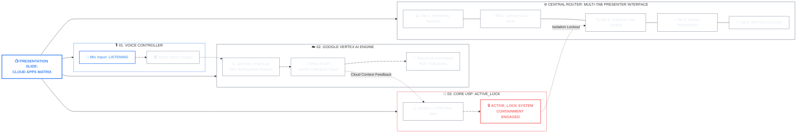

```mermaid
graph LR
    %% Widescreen Layout Initialization (Landscape Slide Ratio)
    SLIDE_START[📺 PRESENTATION SLIDE:<br>CLOUD APPS MATRIX]

    %% ==================== TOP NAVIGATION ROW ====================
    subgraph NAV [🌐 CENTRAL ROUTER: MULTI-TAB PRESENTER INTERFACE]
        T1[📊 Tab 1: Monitoring Terminal]
        T2[🧠 Tab 2: Gemini Cloud Desk]
        T3[🔍 Tab 3: Customer 360 Lookup]
        T4[⚡ Tab 4: Actions Remediation]
        T5[🔐 Tab 5: IAM View Directory]
        T1 --- T2 --- T3 --- T4 --- T5
    end

    %% ==================== PARALLEL FUNCTIONAL COLUMNS ====================
    subgraph COL1 [🎙️ 01. VOICE CONTROLLER]
        V_Mic[🎤 Mic Input: LISTENING] e1@--> V_Macro[🎛️ Action Macro Trigger]
    end

    subgraph COL2 [☁️ 02. GOOGLE VERTEX AI ENGINE]
        M_Sweeps[📈 gemma4_engine.py<br>48hr Rolling Math Sweeps] e2@--> M_Gemini[🧠 Vertex AI API:<br>Gemini Enterprise Client]
        M_Gemini e3@--> M_PDF[📄 ReportLab Automated<br>PDF Filing Briefs]
    end

    subgraph COL3 [🚨 03. CORE USP: ACTIVE_LOCK]
        A_Signal[⚠️ Section 4.2 PEP Risk Alert] e4@--> A_Lock[🔒 ACTIVE_LOCK SYSTEM<br>CONTAINMENT ENGAGED]
    end

    %% ==================== WIDESCREEN ALIGNMENT ROUTING ====================
    SLIDE_START --> NAV
    SLIDE_START --> COL1
    SLIDE_START --> COL2
    SLIDE_START --> COL3

    %% Inter-widget structural data dependencies
    V_Macro -.-> M_Sweeps
    M_Gemini -.->|Cloud Context Feedback| A_Signal
    A_Lock -.->|Isolation Lockout| T3

    %% Class Assigning (Strict compilation compliance mapping)
    class T1,T2,T3,T4,T5,V_Macro,M_Sweeps,M_PDF,A_Signal,M_Gemini widget;
    class SLIDE_START slideFrame;
    class V_Mic voiceActive;
    class A_Lock alertActive;

    %% Global Color Blueprint Parameters (Forced transparency to avoid black blocks)
    classDef default fill:none,stroke:#475569,stroke-width:2px,color:#F8FAFC;
    classDef slideFrame fill:none,stroke:#3B82F6,stroke-width:3px,color:#3B82F6,font-weight:bold;
    classDef widget fill:none,stroke:#64748B,stroke-width:1px,color:#E2E8F0;
    classDef voiceActive fill:none,stroke:#3B82F6,stroke-width:2px,color:#60A5FA,font-weight:bold;
    classDef alertActive fill:none,stroke:#EF4444,stroke-width:2px,color:#F87171,font-weight:bold;

    %% Clear block fills to match dark/light theme shifts natively
    style NAV fill:none,stroke:#475569
    style COL1 fill:none,stroke:#3B82F6,stroke-width:1px
    style COL2 fill:none,stroke:#475569,stroke-width:1px
    style COL3 fill:none,stroke:#EF4444,stroke-width:1px

    %% ⚡ Native Edge Animation Flow Definitions
    e1@{ animate: true }
    e2@{ animate: true }
    e3@{ animate: true }
    e4@{ animate: true }
```
