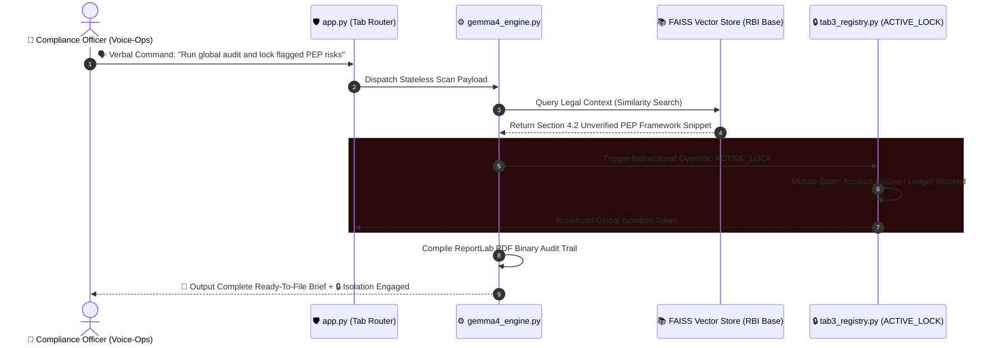

```mermaid
sequenceDiagram
    autonumber
    actor Officer as 🎤 Compliance Officer (Voice-Ops)
    participant App as 🛡️ app.py (Tab Router)
    participant Engine as ⚙️ gemma4_engine.py
    participant VDB as 📚 FAISS Vector Store (RBI Base)
    participant Reg as 🔒 tab3_registry.py (ACTIVE_LOCK)

    Officer->>App: 🗣️ Verbal Command: "Run global audit and lock flagged PEP risks"
    App->>Engine: Dispatch Stateless Scan Payload
    Engine->>VDB: Query Legal Context (Similarity Search)
    VDB-->>Engine: Return Section 4.2 Unverified PEP Framework Snippet
    
    rect rgb(40, 10, 10)
        Engine->>Reg: Trigger Bidirectional Override: ACTIVE_LOCK
        Reg->>Reg: Mutate State: Account Frozen / Ledger Blocked
        Reg-->>App: Broadcast Global Isolation Token
    end

    Engine->>Engine: Compile ReportLab PDF Binary Audit Trail
    Engine-->>Officer: 📄 Output Complete Ready-To-File Brief + 🔒 Isolation Engaged
```
